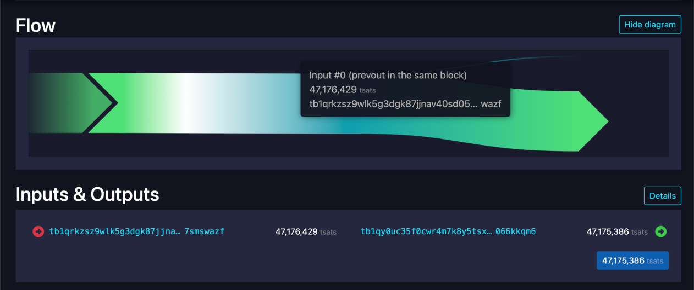

# BitVM's Latest Progress

BitVM enables a free market of second layers, potentially scaling Bitcoin to billions of users.

## Process Set
BitVM is a computing paradigm to express Turing-complete Bitcoin contracts. This requires no changes to the network’s consensus rules. Rather than executing computations on Bitcoin, they are merely verified, similarly to optimistic rollups. A prover makes a claim that a given function evaluates for some particular inputs to some specific output. If that claim is false, anyone can perform a fraud proof and punish the prover. Using this mechanism, any computable function can be verified on Bitcoin.

BitVM is the foundational element to bridge BTC to second layers such as sidechains, rollups, and [zkCoins](https://gist.github.com/RobinLinus/d036511015caea5a28514259a1bab119).

## Test Cases
- Cli interactive [test cases](https://github.com/BitVM/BitVM) that can demo the process set. 

## Testnet Transactions
### Transanciton One 
This  [transaction hash](https://gist.github.com/RobinLinus/d036511015caea5a28514259a1bab119)  was ..........

### Transanciton Two 
This  [transaction hash](https://gist.github.com/RobinLinus/d036511015caea5a28514259a1bab119)  was ..........

## Write Up 
A write up about the process and demo

XXX
XXX read [more](https://gist.github.com/RobinLinus/d036511015caea5a28514259a1bab119).                                                                                                       

## Recorded Video

  <iframe src="https://www.youtube.com/embed/Kkhei1h6fKc?si=-yF0dW9B_3i21obW" 
          title="YouTube video player" 
          frameborder="0" 
          allow="accelerometer; autoplay; clipboard-write; encrypted-media; gyroscope; picture-in-picture; web-share" 
          referrerpolicy="strict-origin-when-cross-origin" 
          allowfullscreen
          style="position: absolute; top: 0; left: 0; width: 100%; height: 100%;">
  </iframe>

## Slides

  <iframe src="https://docs.google.com/presentation/d/1z6JCbc4lxda2C4k5wvk8Xq-ImukjeCkdkrvZfmQtv2I/edit#slide=id.g31fe76eb03d_2_1" 
          frameborder="0" 
          allowfullscreen="true" 
          style="position: absolute; top: 0; left: 0; width: 100%; height: 100%;">
  </iframe>

This page is contributed by <a href="https://www.bitlayer.org/">Bitlayer</a>.

